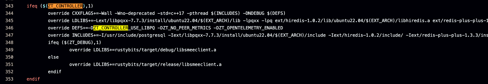

## 概述

该库的作用主要是用以构建和部署自己的ZeroTier服务器。在缺省情况下：

1. 没有自主性，需要通过ZeroTier官网进行管理
2. 在Mac设备上，无法连接Moon服务器
3. Moon 设备的握手需要通过planet进行，默认的planet服务器都在国外

## 注意事项

**移除zerotier-cli**：使用该仓库所构建的ZeroTier-One镜像不支持加入网络，因为是控制器版本，所以连peer信息也没有，`zerotier-cli`命令无效，但是保留了`api`服务功能，可以通过该API服务，进行二次开发。

**剔除ztncui**：后续可能会剔除ztncui，NPM管理大概占用了114M

**控制器和客户端**：使用容器启动的仅为控制器，并不是客户端，所以你需要在云主机上面安装一个ZeroTier。替换`planet`文件，加入控制器创建的网络中。不建议在裸机上运行ZeroTier-One，这会导致你的ZeroTier控制器无法加入网络管理。

**关于ZeroTier端口**：ZeroTier默认使用9993，并且我不建议你修改，我尝试过修改，后续是无法进行通信。云主机防火墙放行9993的TCP和UDP端口，TCP的端口用以在UDP无法建立通信时进行中继，当然这是极少数情况。如果当地运营商Qos UDP限速严重，那么修改`local.conf`文件，并重启ZeroTier控制器。所以不会提供任何修改默认端口的能力，

> 容器内：`/var/lib/zerotier-one/local.conf`
>
> 宿主机：`$DATA/one/local.conf`
> 
> 若没有直接创建即可，将`force

相关请参考[官方文档](https://docs.zerotier.com/relay/)

**deploy脚本**：deploy脚本暂时不支持IPv6，Dockerfile的内容也是为国内用户设计的，国外的话就没有必要自建Planet了，直接使用moon的方式更好一点。

> 推荐使用podman作为容器管理，关闭本地防火墙。先使用云主机防火墙过渡，暂时未知原因。如果不能够接受，直接使用docker也可以

## 使用

```shell
git clone https://github.com/Xiwin/define-your-zerotier.git

cd define-your-zerotier
chmod +x ./deploy.sh
sudo deploy.sh
```

`deploy.sh` 部署脚本，自带6个功能：

1. 构建: 构建镜像会导出一份本地镜像（主要使用构建即可，镜像太大，通过Hub进行分发太麻烦了）
2. 运行: 拉取远程镜像并运行（如果你能看懂compose文件，该功能对你用处不大）
3. 配置: 设置运行配置
4. 打印信息: planet 和 moon 
5. 重置密码: 重置Ztncui管理面板账号密码（可以去Ztncui官网查看如何重置密码，不必依赖该功能）

> 注意1：主机映射9993/tcp 和 9993/udp 端口不可更改。若出现，9993端口冲突，请优先考虑ZeroTier，若Planet的端口不为9993，Client将无法连接。

> 注意2：可以直接使用sftp或scp工具下载 planet 到本地，planet和moon文件存放在/dist目录中

当然你也可以直接参考项目下的`.env.template`，新建`.env`文件，用以在`compose`运行时读取环境变量。`deploy.sh`脚本不一定兼容所有操作系统。

### 如何修改planet IP？

在本项目的`deploy.sh`脚本中，只提供了单个IP的加入方式，如果想添加多个IP怎么办？生成新的`planet`即可，生成的`planet`不会影响现有环境，无需重启`ZeroTier Controller`，只需要下发新生成的`planet`即可。

`planet`的生成参考的是`moon.json`文件，如果已经成功启动`ZeroTIer`容器，那么就无需再此生成该文件。生成该文件后我们需要对该文件进行修改`stableEndpoints`字段即可：

```json
{
  "id": "略",
  "objtype": "world",
  "roots": [
    {
      "identity": "略",
      "stableEndpoints": [
        "117.154.86.48/9993",
        "3af2:b11e:f300:37c1:0af1:657d:0820:7759/9993"
      ]
    }
  ],
  "signingKey": "略",
  "signingKey_SECRET": "略",
  "updatesMustBeSignedBy": "略",
  "worldType": "moon"
}
```

> `stableEndpoints` 字段可容纳两个元素：
>
> 1. IPv4/端口
> 2. IPv6/端口
> 
> 是否能够容纳更多有待考证

上述内容完成后，在宿主机上即可操作，进入`data/one`目录，该目录下有一个可执行文件`mkworld`。执行`./mkworld`即可，执行完成后会在该目录下生成一个`world.bin`文件，将该文件拷贝为`planet`即可

> `./mkworld`执行完成后，可通过`./mkworld -b`检查planet是否正确

## 迁移与集群部署

ZeroTier Planet的迁移是非常简单的，因为ZeroTier控制器的所有数据记录均基于文件，所以在迁移时只需要保存相关文件即可。集群部署也是如此，使用集群存储解决方案，将ZeroTier的数据文件保存在集群存储中。

## 目录结构

```shell
.
├── build
│   ├── build.sh
│   ├── Dockerfile
│   ├── img
│   └── patch
│       ├── cargo_config
│       ├── check.sh
│       ├── entrypoint.sh
│       └── mkworld_custom.cpp
├── deploy.sh
├── docker-compose.yaml
├── install
│   └── README.md
├── README.assets
│   └── image.png
└── README.md
```

## Dockerfile描述

Dockefile 使用 Docker 的buildx插件来将镜像的build的拆分为两个部分：

+ 构建基础软件，zerotier-one控制器版本和Ztncui
+ 通过 `COPY --from=builder` 拷贝构建完成的软件

采用的镜像为[debian:bookworm-slimy,debian12]()，选择该镜像的目的主要有如下：

1. ZeroTier的控制器版本依赖问题，控制器版本需要构建postgresql和redis
2. slimy是debian的容器精简版本，剔除了不必要的软件和文档等

### ZeroTier依赖问题

通过下图在源码仓库的`/make-linux.mk`文件中，我们可以看到，依赖相关内容：



依赖与`ubuntu 22.04` 相关包，Ubuntu是Debian的下游发行版，我个人总觉得Debian比Ubuntu精简，所以在这里我选择了Debian。

## 相关文档

+ [ZeroTier-One 仓库](https://github.com/zerotier/ZeroTierOne)
+ [Rust镜像源](https://developer.aliyun.com/article/1552431)
+ [Cargo镜像源](https://www.cnblogs.com/trigger-cn/p/18334279)
+ [Github镜像站](https://ghproxy.link/)
+ [Ztncui 仓库](https://github.com/key-networks/ztncui)